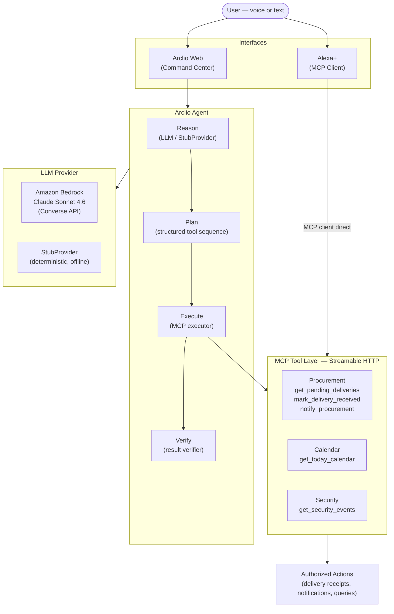

# Arclio

**AI orchestration for the real world.**

Arclio turns natural-language requests into coordinated business operations. A user asks what is happening, what needs attention, or asks Arclio to carry out an authorized action. Arclio reasons about the request, creates a structured execution plan, runs the appropriate MCP tools, and verifies the result — all within a single conversational exchange.

---

## What Arclio Does

Most business operations involve querying multiple systems, correlating the results, and taking action based on what is found. Arclio automates that loop. Instead of manually checking calendars, delivery trackers, and security logs, a user can ask a single natural-language question and receive a verified, composed answer with any authorized actions already taken.

Arclio is not a chatbot wrapper. It is an orchestration layer: the LLM reasons and plans, MCP tools execute, and a verifier confirms the outcome before the response is returned.

---

## Core Workflow

```
Reason      — understand the intent behind the user's request
   ↓
Plan        — build a structured, ordered sequence of tool calls
   ↓
Execute     — invoke each MCP tool and collect results
   ↓
Verify      — confirm outcomes match intent before responding
```

---

## Architecture



**Web path:** User → Arclio Web → Agent (Reason → Plan → Execute → Verify) → Bedrock → MCP tools → response

**Alexa+ path:** User → Alexa+ → Arclio MCP server → tools directly (Alexa+ acts as MCP client; Arclio is not powered by Alexa+)

---

## Why MCP

Arclio uses the [Model Context Protocol](https://modelcontextprotocol.io) (MCP) for all tool execution.

- **Standardized interface** — tools are defined once and usable by any MCP-compatible client
- **Separation of concerns** — the LLM reasons and plans; MCP tools execute; neither role bleeds into the other
- **Authorization boundary** — every real-world action passes through an explicit, registered tool
- **Extensibility** — new operational domains (HR, finance, facilities) can be added as MCP tool groups without changing the agent pipeline
- **Alexa+ compatibility** — Alexa+ can connect to Arclio as an MCP client, invoking the same tools the agent uses

---

## Current Capabilities

The following are implemented and tested in this repository:

| Capability | Status |
|---|---|
| Natural-language command input | ✓ |
| Intent detection and plan generation | ✓ |
| Structured plan validation (tool allowlist) | ✓ |
| MCP tool execution via Streamable HTTP | ✓ |
| Procurement — delivery queries and receipt | ✓ |
| Procurement — team notifications | ✓ |
| Calendar — today's schedule | ✓ |
| Security — event log queries | ✓ |
| Result verification (passed / partial / failed) | ✓ |
| Amazon Bedrock provider (Claude Sonnet 4.6) | ✓ |
| StubProvider for offline development | ✓ |
| Web command center (React) | ✓ |
| Activity timeline and agent response panel | ✓ |
| Cross-process notification store | ✓ |
| Alexa+ MCP integration | Integration target |
| Alexa+ Simulator (web) | ✓ |

---

## Example Workflows

### 1. Office Briefing

> *"What's happening at the office today?"*

**Tools:** `get_today_calendar` · `get_pending_deliveries` · `get_security_events`

Arclio retrieves today's meetings, active deliveries, and relevant security events, then composes a single briefing response. Verification confirms all three data sources responded successfully.

---

### 2. Delivery Status

> *"Is the Acme delivery here yet?"*

**Tools:** `get_pending_deliveries` (vendor: acme) · `get_security_events` (type: delivery_arrival)

Arclio checks the delivery record for status and cross-references the security log for a delivery vehicle arrival event. The response confirms whether the vehicle has arrived, is on-site, or has not yet appeared.

---

### 3. Mark Delivery Received

> *"Mark the Acme delivery as received and notify procurement."*

**Tools:** `get_pending_deliveries` → `mark_delivery_received` → `notify_procurement`

Arclio resolves the delivery ID from the pending list, marks it received (with timestamp), then sends an internal notification to the procurement team. Verification confirms the delivery status was updated and the notification was dispatched.

---

## Amazon Bedrock

Arclio uses Amazon Bedrock as its production LLM provider via the **Converse API**.

- **Model:** `global.anthropic.claude-sonnet-4-6` (global inference profile)
- **Auth:** Bearer token (`AWS_BEARER_TOKEN_BEDROCK`) or standard AWS credential chain
- **Region:** `us-east-1` (configurable via `AWS_REGION`)
- **Interface:** Bedrock Converse API — model-agnostic, structured input/output

The Bedrock provider produces a structured JSON plan that passes through the plan validator before reaching the MCP executor. The LLM does not call tools directly.

For local development and CI, `StubProvider` provides deterministic intent matching with no AWS credentials required.

---

## Alexa+ and MCP

Arclio exposes a Streamable HTTP MCP server. Alexa+ can connect to this server as an MCP client and invoke Arclio's registered tools directly, enabling voice-driven business operations.

**Integration model:**
```
User (voice) → Alexa+ → Arclio MCP server → tools → authorized actions
```

Alexa+ is the conversational interface in this path. Arclio is the tool execution layer. The Alexa+ integration is the primary next development milestone; the MCP server is already running and tool-complete.

---

## Project Structure

```
arclio/
├── packages/
│   ├── agent/               # Arclio reasoning agent
│   │   └── src/
│   │       ├── agent.ts         # Main pipeline (Reason→Plan→Execute→Verify)
│   │       ├── executor.ts      # MCP tool executor (Streamable HTTP)
│   │       ├── plan-validator.ts# Safety boundary — tool allowlist
│   │       ├── verifier.ts      # Result verifier
│   │       ├── synthesizer.ts   # Response builder
│   │       ├── tool-registry.ts # Registered MCP tools
│   │       ├── types.ts         # Shared pipeline types
│   │       ├── providers/
│   │       │   ├── bedrock.ts   # Amazon Bedrock (Converse API)
│   │       │   ├── stub.ts      # Deterministic offline provider
│   │       │   └── index.ts     # Provider factory
│   │       └── tests/           # Unit tests (30 passing)
│   │
│   ├── mcp-server/          # MCP server — Streamable HTTP transport
│   │   └── src/
│   │       ├── index.ts         # Express + MCP session manager
│   │       ├── tools/
│   │       │   ├── calendar.ts
│   │       │   ├── procurement.ts
│   │       │   └── security.ts
│   │       └── data/
│   │           ├── mock-data.ts        # In-memory business data
│   │           └── notification-store.ts# Cross-process file store
│   │
│   ├── api/                 # HTTP bridge — web UI to agent
│   │   └── src/
│   │       └── index.ts         # Express: /api/agent, /api/dashboard, data endpoints
│   │
│   └── web/                 # React command center
│       └── src/
│           ├── App.tsx
│           ├── api.ts           # Typed API client
│           ├── types.ts         # Shared UI types
│           └── components/
│               ├── AgentInput.tsx
│               ├── AgentResponsePanel.tsx
│               ├── ActivityFeed.tsx
│               ├── CalendarCard.tsx
│               ├── DeliveriesCard.tsx
│               ├── SecurityCard.tsx
│               ├── ProcurementPage.tsx
│               ├── ReportsPage.tsx
│               ├── SettingsPage.tsx
│               └── Sidebar.tsx
│
├── docs/
│   └── architecture.md
├── .gitignore
├── package.json             # Monorepo root (npm workspaces)
└── tsconfig.base.json
```

---

## Development

### Prerequisites

- Node.js ≥ 20
- npm ≥ 10

### Install

```bash
npm install
```

### Run the full stack (recommended)

Starts MCP server, API server, and web dev server concurrently:

```bash
npm run dev
```

| Service | URL |
|---|---|
| Web UI | http://localhost:5173 |
| API server | http://localhost:3002 |
| MCP server | http://localhost:3001 |

### Run services individually

```bash
npm run dev:server   # MCP server (port 3001)
npm run dev:api      # API server (port 3002)
npm run dev:web      # Vite dev server (port 5173)
```

### Build all packages

```bash
npm run build
```

### Tests

```bash
npm test
```

Runs the full agent test suite (30 tests — no AWS credentials required).

### Bedrock live verification

After setting your Bedrock credentials:

```bash
node packages/agent/dist/verify-bedrock-live.js
```

---

## Environment Configuration

| Variable | Required for Bedrock | Default | Description |
|---|---|---|---|
| `ARCLIO_LLM_PROVIDER` | No | `stub` | `stub` or `bedrock` |
| `AWS_BEARER_TOKEN_BEDROCK` | For bearer auth | — | Bedrock API key |
| `AWS_ACCESS_KEY_ID` + `AWS_SECRET_ACCESS_KEY` | For IAM auth | — | Standard AWS credentials |
| `ARCLIO_MODEL_ID` | No | `global.anthropic.claude-sonnet-4-6` | Bedrock model ID |
| `AWS_REGION` | No | `us-east-1` | AWS region |
| `MCP_BASE_URL` | No | `http://localhost:3001/mcp` | MCP server endpoint |
| `API_PORT` | No | `3002` | API server port |
| `PORT` | No | `3001` | MCP server port |

> Never commit credentials to Git. Use environment variables or a local `.env` file (excluded by `.gitignore`).

---

## Testing

The agent package includes three test suites, all run with the Node.js built-in test runner:

| Suite | Coverage | Tests |
|---|---|---|
| `stub-provider.test.ts` | All intent patterns, tool selection, vendor extraction | 9 |
| `plan-validator.test.ts` | Schema validation, tool allowlist, step limits | 8 |
| `bedrock-provider.test.ts` | Mocked Bedrock client — happy path, error cases, fallback | 13 |

**Current status:** 30 / 30 passing. No AWS credentials required.

---

## Security

- All credentials are environment-variable-based — nothing is hardcoded
- `.gitignore` excludes `.env`, `.env.*`, `*.key`, `*.pem`, AWS credential files, and the runtime notification store
- MCP tools represent explicit, registered authorization boundaries — no ad-hoc tool invocation is possible
- The plan validator enforces a strict tool allowlist before any execution occurs
- The LLM produces a plan; it never calls tools directly

---

## Roadmap

- [ ] Alexa+ voice integration (MCP client connection)
- [ ] Persistent data layer (replace in-memory mock data)
- [ ] Additional MCP tool groups (HR, facilities, finance)
- [ ] Multi-step approval workflows
- [ ] Real business system connectors (ERP, Google Calendar, physical access)
- [ ] AWS deployment (Lambda / ECS)

---

## Alexa+ Simulator

Arclio includes a dedicated **Alexa+ Simulation** experience for the hackathon — a polished conversational interface that demonstrates how Arclio works when accessed through Alexa+.

```
http://localhost:5173  →  click "Alexa+ Simulator" in the sidebar
```

The simulator connects to the existing Arclio agent pipeline (no new backend required). It supports voice input via the browser Web Speech API and text-to-speech responses, with a reliable click-to-run demo mode that does not depend on voice recognition.

→ See [docs/alexa-simulation.md](docs/alexa-simulation.md) for full architecture, user flows, and integration details.

---

## Hackathon

Built for the **Amazon Developer Hackathon**.

**Technologies used:**
- Amazon Bedrock (Claude Sonnet 4.6, Converse API, global inference profile)
- Model Context Protocol (MCP) — Streamable HTTP transport
- Alexa+ (integration target — MCP client)
- TypeScript · Node.js · React · Vite · Express

---

*License to be added.*
