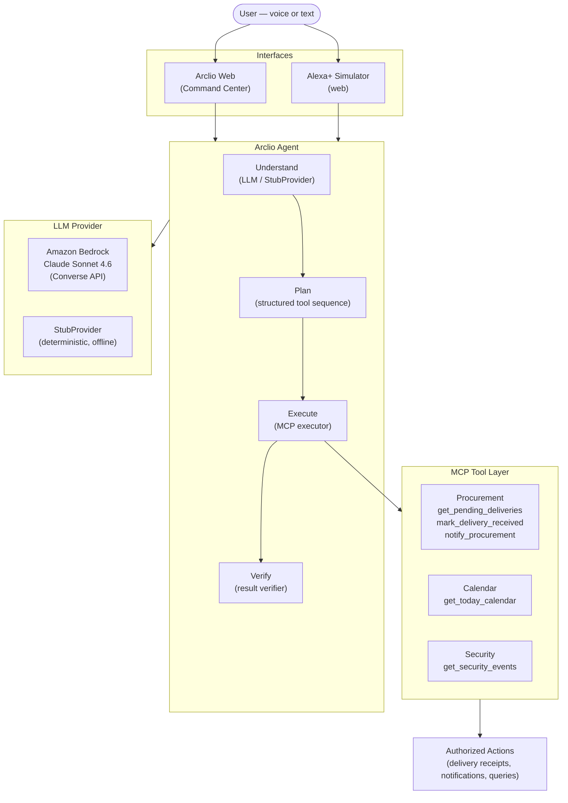

# Arclio

**AI orchestration for the real world.**

Arclio is an AI orchestration layer for business operations. A user asks what is happening, what needs attention, or asks Arclio to carry out an authorized action. Arclio understands the request, creates a structured execution plan, runs the appropriate MCP tools, and verifies the result — all within a single conversational exchange.

---

## Core Flow

```
ASK        — natural-language input (voice or text)
   ↓
UNDERSTAND — intent detection (LLM or deterministic stub)
   ↓
PLAN       — structured, ordered sequence of MCP tool calls
   ↓
EXECUTE    — invoke each tool and collect results
   ↓
VERIFY     — confirm outcomes match intent before responding
```

---

## Architecture



---

## Core Capabilities

| Capability | Description |
|---|---|
| **Business Briefing** | Full operational snapshot — meetings, deliveries, comms, security |
| **Calendar** | Today's schedule from the connected calendar system |
| **Procurement** | Delivery status, receipt sign-off, team notifications |
| **Deliveries** | In-transit and pending delivery tracking |
| **Security** | Access events, alerts, and anomalies from the security log |
| **Communications** | Pending approvals, supplier replies, outstanding actions |
| **Follow-ups** | What is due today and what needs a response |
| **Voice** | Full voice I/O in the Alexa+ Simulator (ElevenLabs TTS + browser speech input) |

---

## MCP Architecture

Arclio uses the [Model Context Protocol](https://modelcontextprotocol.io) (MCP) for all tool execution.

**Tool execution paths:**

| Environment | Path |
|---|---|
| **Production / Vercel** | Direct in-process — `@arclio/mcp-server/direct` functions are called inside the same Node process. No separate server, no HTTP round-trip. |
| **Local dev** | HTTP — the agent and API reach the standalone MCP server at `MCP_BASE_URL` (default: `http://localhost:3001/mcp`) over Streamable HTTP / JSON-RPC. |

The execution path is selected automatically: if `MCP_BASE_URL` is not set, the direct path is used.

**Why MCP:**

- **Standardized interface** — tools are defined once and usable by any MCP-compatible client
- **Separation of concerns** — the LLM reasons and plans; MCP tools execute; neither role bleeds into the other
- **Authorization boundary** — every real-world action passes through an explicit, registered tool
- **Extensibility** — new operational domains (HR, finance, facilities) can be added as MCP tool groups without changing the agent pipeline

---

## Alexa+ Simulator

Arclio includes a dedicated **Alexa+ Simulation** experience built for the hackathon. It is a polished conversational interface that demonstrates how Arclio would work when accessed through an Alexa+ voice interaction.

> **Note:** This is a simulated Alexa+ experience. It does not use the official Alexa+ runtime and does not claim to. It is a purpose-built web UI that replicates the interaction model — voice input, voice response, suggested prompts, and a staged execution timeline — using the browser Web Speech API and ElevenLabs TTS. The same Arclio agent pipeline powers it.

**Access:** open the app → click **Alexa+ Simulator** in the sidebar.

**Features:**
- Voice input via browser Web Speech API
- Text-to-speech responses (ElevenLabs in production; browser SpeechSynthesis as fallback)
- Suggested prompt chips for one-click demo flows
- Staged execution timeline (Listening → Understanding → Planning → Executing → Verifying)
- Tool-call cards surfacing which MCP tools ran and what they returned

---

## Voice

Voice output in the Alexa+ Simulator is handled by two layers:

| Layer | When used |
|---|---|
| **ElevenLabs** | When `ELEVENLABS_API_KEY` and `ELEVENLABS_VOICE_ID` are configured. Low-latency streaming TTS via `eleven_flash_v2_5` (default model). |
| **Browser SpeechSynthesis** | Fallback when ElevenLabs is not configured. Zero cost, no API key required. |

When both are configured, the simulator offers a voice-source toggle. No credentials or voice IDs are exposed to the browser.

---

## Example Workflows

### Primary experience

> *"Give me my business briefing."*

**Tools:** `get_today_calendar` · `get_pending_deliveries` · `get_security_events`

Arclio retrieves today's meetings, active deliveries, pending comms, follow-ups, and security events, then composes a single concise briefing response optimized for voice delivery.

---

### What needs my attention?

> *"What needs my attention?"*

**Tools:** `get_pending_deliveries` · `get_today_calendar` · `get_security_events`

Arclio surfaces the most urgent items across all connected systems — in-transit deliveries needing sign-off, upcoming meetings needing prep, security alerts, and pending approvals.

---

### Is anything waiting on me?

> *"Is anything waiting on me?"*

**Tools:** `get_pending_deliveries`

Arclio surfaces pending approvals, outstanding supplier replies, and deliveries awaiting sign-off — items that are blocked on the user's action.

---

### Handle the Acme delivery

> *"Handle the Acme delivery."*

**Tools:** `get_pending_deliveries` → `mark_delivery_received` → `notify_procurement`

Arclio resolves the delivery ID from the pending list, marks it received with a timestamp, and sends an internal notification to the procurement team. Verification confirms both the status update and the notification dispatch.

---

### What should I follow up on today?

> *"What should I follow up on today?"*

**Tools:** `get_pending_deliveries` · `get_today_calendar`

Arclio compiles today's follow-up list: supplier check-ins, pending approvals, meeting prep, and delivery confirmations.

---

## Amazon Bedrock

Arclio uses Amazon Bedrock as its production LLM provider via the **Converse API**.

- **Model:** `global.anthropic.claude-sonnet-4-6` (global inference profile)
- **Auth:** Bearer token (`AWS_BEARER_TOKEN_BEDROCK`) or standard AWS credential chain
- **Region:** `us-east-1` (configurable via `AWS_REGION`)
- **Interface:** Bedrock Converse API — model-agnostic, structured input/output

The Bedrock provider produces a structured JSON plan that passes through the plan validator before reaching the MCP executor. The LLM does not call tools directly.

For local development and CI, `StubProvider` provides deterministic intent matching with no AWS credentials required.

---

## Project Structure

```
arclio/
├── packages/
│   ├── agent/               # Arclio reasoning agent
│   │   └── src/
│   │       ├── agent.ts             # Main pipeline (Understand→Plan→Execute→Verify)
│   │       ├── executor.ts          # MCP executor (HTTP + direct in-process)
│   │       ├── plan-validator.ts    # Safety boundary — tool allowlist
│   │       ├── verifier.ts          # Result verifier
│   │       ├── synthesizer.ts       # Response builder (all intents)
│   │       ├── tool-registry.ts     # Registered MCP tools
│   │       ├── types.ts             # Shared pipeline types
│   │       ├── providers/
│   │       │   ├── bedrock.ts       # Amazon Bedrock (Converse API)
│   │       │   ├── stub.ts          # Deterministic offline provider
│   │       │   └── index.ts         # Provider factory
│   │       └── tests/               # Unit tests (30 passing)
│   │
│   ├── mcp-server/          # MCP tool layer
│   │   └── src/
│   │       ├── index.ts             # Express + MCP session manager (local dev)
│   │       ├── direct.ts            # In-process tool dispatch (production)
│   │       ├── tools/
│   │       │   ├── calendar.ts
│   │       │   ├── procurement.ts
│   │       │   └── security.ts
│   │       └── data/
│   │           ├── mock-data.ts          # In-memory business data
│   │           └── notification-store.ts # In-memory + optional file-backed store
│   │
│   ├── api/                 # HTTP bridge — web UI ↔ agent
│   │   └── src/
│   │       ├── app.ts               # Express: /api/agent, /api/dashboard, data endpoints
│   │       └── tests/
│   │           └── voice.test.ts    # ElevenLabs proxy unit tests (8 tests)
│   │
│   └── web/                 # React command center
│       └── src/
│           ├── App.tsx
│           ├── api.ts               # Typed API client
│           ├── types.ts             # Shared UI types
│           └── components/
│               ├── AlexaSimulator.tsx
│               ├── AgentInput.tsx
│               ├── AgentResponsePanel.tsx
│               ├── ActivityFeed.tsx
│               ├── CalendarCard.tsx
│               ├── DeliveriesCard.tsx
│               ├── SecurityCard.tsx
│               ├── ProcurementPage.tsx
│               ├── ReportsPage.tsx
│               ├── SettingsPage.tsx
│               └── Sidebar.tsx
│
├── .env.example
├── package.json             # Monorepo root (npm workspaces)
└── tsconfig.base.json
```

---

## Development

### Prerequisites

- Node.js ≥ 20
- npm ≥ 10

### Install

```bash
npm install
```

### Run the full stack (recommended)

Starts MCP server, API server, and web dev server concurrently:

```bash
npm run dev
```

| Service | URL |
|---|---|
| Web UI | http://localhost:5173 |
| API server | http://localhost:3002 |
| MCP server | http://localhost:3001 |

### Run services individually

```bash
npm run dev:server   # MCP server (port 3001)
npm run dev:api      # API server (port 3002)
npm run dev:web      # Vite dev server (port 5173)
```

### Build all packages

```bash
npm run build
```

### Tests

```bash
npm test
```

Runs the full agent and API test suites. No AWS credentials required.

| Suite | Coverage | Tests |
|---|---|---|
| `stub-provider.test.ts` | Intent patterns, tool selection, vendor extraction | 9 |
| `plan-validator.test.ts` | Schema validation, tool allowlist, step limits | 8 |
| `bedrock-provider.test.ts` | Mocked Bedrock client — happy path, error cases, fallback | 13 |
| `voice.test.ts` | ElevenLabs proxy — config, TTS, error handling | 8 |

**Current status:** 38 tests passing. No AWS credentials required.

### Bedrock live verification

After setting your Bedrock credentials:

```bash
node packages/agent/dist/verify-bedrock-live.js
```

---

## Environment Configuration

| Variable | Required | Default | Description |
|---|---|---|---|
| `ARCLIO_LLM_PROVIDER` | No | `stub` | `stub` or `bedrock` |
| `AWS_BEARER_TOKEN_BEDROCK` | For Bedrock bearer auth | — | Bedrock API key |
| `AWS_ACCESS_KEY_ID` + `AWS_SECRET_ACCESS_KEY` | For Bedrock IAM auth | — | Standard AWS credentials |
| `ARCLIO_MODEL_ID` | No | `global.anthropic.claude-sonnet-4-6` | Bedrock model ID |
| `AWS_REGION` | No | `us-east-1` | AWS region |
| `MCP_BASE_URL` | No | *(unset → direct path)* | MCP server URL for local dev (`http://localhost:3001/mcp`) |
| `PORT` | No | `3001` | MCP server port (local dev) |
| `API_PORT` | No | `3002` | API server port (local dev) |
| `ELEVENLABS_API_KEY` | No | — | ElevenLabs API key (Alexa+ Simulator voice) |
| `ELEVENLABS_VOICE_ID` | No | — | ElevenLabs voice ID |
| `ELEVENLABS_MODEL_ID` | No | `eleven_flash_v2_5` | ElevenLabs model |
| `ARCLIO_NOTIFY_FILE` | No | *(unset → in-memory)* | Set to `1` to enable file-backed notification store (local dev cross-process) |

> Never commit credentials to Git. Use environment variables or a local `.env` file (excluded by `.gitignore`).

---

## Security

- All credentials are environment-variable-based — nothing is hardcoded
- `.gitignore` excludes `.env`, `.env.*`, `*.key`, `*.pem`, AWS credential files, and the runtime notification store
- MCP tools represent explicit, registered authorization boundaries — no ad-hoc tool invocation is possible
- The plan validator enforces a strict tool allowlist before any execution occurs
- The LLM produces a plan; it never calls tools directly
- ElevenLabs API key and voice ID are server-side only — never sent to the browser

---

## Current Capabilities

| Capability | Status |
|---|---|
| Natural-language command input | ✓ |
| Intent detection and plan generation | ✓ |
| Structured plan validation (tool allowlist) | ✓ |
| MCP tool execution — HTTP and direct in-process | ✓ |
| Procurement — delivery queries and receipt | ✓ |
| Procurement — team notifications | ✓ |
| Calendar — today's schedule | ✓ |
| Security — event log queries | ✓ |
| Business briefing (multi-system snapshot) | ✓ |
| Needs-attention and follow-up intents | ✓ |
| Pending approval and waiting-on-me intents | ✓ |
| Result verification (passed / partial / failed) | ✓ |
| Amazon Bedrock provider (Claude Sonnet 4.6) | ✓ |
| StubProvider for offline development | ✓ |
| Web command center (React) | ✓ |
| Activity timeline and agent response panel | ✓ |
| Notification store (in-memory + file-backed opt-in) | ✓ |
| Alexa+ Simulator (web — simulated experience) | ✓ |
| ElevenLabs TTS with browser fallback | ✓ |

---

## Hackathon

Built for the **Amazon Developer Hackathon**.

Arclio demonstrates a practical AI orchestration layer for business operations, with the Alexa+ Simulator providing a conversational voice interaction experience. The simulator is a purpose-built web UI that simulates how Arclio would work as an Alexa+ skill — it does not use the official Alexa+ runtime.

**Technologies used:**
- Amazon Bedrock (Claude Sonnet 4.6, Converse API, global inference profile)
- Model Context Protocol (MCP) — Streamable HTTP transport + direct in-process path
- ElevenLabs (voice synthesis for the Alexa+ Simulator)
- TypeScript · Node.js · React · Vite · Express · Vercel

---

## Roadmap

- [ ] Persistent data layer (replace in-memory mock data)
- [ ] Real Alexa+ skill registration and runtime integration
- [ ] Additional MCP tool groups (HR, facilities, finance)
- [ ] Multi-step approval workflows
- [ ] Real business system connectors (ERP, Google Calendar, physical access)
- [ ] AWS deployment (Lambda / ECS)

---

*License to be added.*
