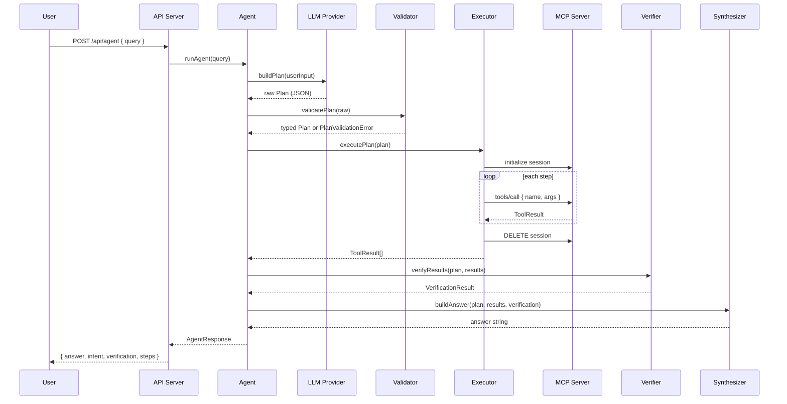

# Arclio — Architecture

Technical reference for the Arclio agent pipeline, MCP tool layer, and application structure.

---

## 1. Overview

Arclio is a TypeScript monorepo consisting of four packages:

| Package | Role |
|---|---|
| `packages/agent` | LLM reasoning agent — Reason → Plan → Execute → Verify |
| `packages/mcp-server` | MCP tool server — Streamable HTTP transport |
| `packages/api` | HTTP bridge — web UI to agent pipeline |
| `packages/web` | React command center |

All inter-service communication uses HTTP. The MCP server and API server run as independent Node.js processes. The web application communicates with the API server via Vite's dev proxy.

---

## 2. Agent Pipeline — Reason → Plan → Execute → Verify



### Stage details

**Reason (LLM Provider)**
The provider receives raw user input and returns a `Plan` — a structured JSON object containing the detected intent and an ordered list of tool calls. The LLM produces a plan; it never calls tools directly.

**Plan Validation**
Every plan passes through `plan-validator.ts` before reaching the executor. Validation enforces:
- Structural correctness (Zod schema)
- Tool allowlist — only registered MCP tool names are permitted
- Step limit (max 10 steps)
- Argument JSON-serializability

Validation failure produces a `PlanValidationError`, which the agent catches and converts to an `intent: "unknown"` fallback plan. The executor never sees a malformed plan.

**Execute**
The executor opens a single MCP session per `runAgent` call, executes each step sequentially, and closes the session on completion (or error). A special runtime resolution step handles `deliveryId: "__resolve__"` — looking up the actual delivery ID from a prior `get_pending_deliveries` result within the same execution.

**Verify**
The verifier inspects `ToolResult[]` against the plan intent. It produces a `VerificationStatus` of `passed`, `partial`, or `failed` based on the ratio of successful tool calls, with intent-aware detail messages.

**Synthesize**
The synthesizer produces the final natural-language answer from the verified results. Each intent has a dedicated builder function that formats the relevant data. The synthesizer is a pure function — it is the correct replacement point for an LLM-powered response generation step.

---

## 3. LLM Providers

### StubProvider

`packages/agent/src/providers/stub.ts`

Deterministic rule-based planner using regex intent matching. No external dependencies, no API calls. The default provider (`ARCLIO_LLM_PROVIDER=stub`).

Intent taxonomy:

| Intent | Trigger patterns | Tools |
|---|---|---|
| `office_briefing` | "what's happening today", "daily briefing" | calendar + deliveries + security |
| `mark_received` | "mark delivery received", "confirm receipt" | pending deliveries → mark received [→ notify] |
| `delivery_status` | "is the X delivery here", "delivery status" | pending deliveries + security |
| `calendar_only` | "what meetings", "my calendar" | calendar |
| `security_only` | "security events", "access log" | security |
| `unknown` | no pattern matched | (no tools) |

### BedrockProvider

`packages/agent/src/providers/bedrock.ts`

Uses Amazon Bedrock Runtime Converse API. Sends a system prompt containing the full tool registry and output format specification, then parses and validates the model's JSON response.

- **Model:** `global.anthropic.claude-sonnet-4-6` (configurable via `ARCLIO_MODEL_ID`)
- **Region:** `us-east-1` (configurable via `AWS_REGION`)
- **Auth mode A:** `AWS_BEARER_TOKEN_BEDROCK` — Bedrock API key (bearer token)
- **Auth mode B:** Standard AWS credential chain (IAM keys, profile, instance role)
- **Inference config:** `temperature: 0`, `maxTokens: 2048`

The model response is parsed through `extractJson()` which handles direct JSON, markdown-fenced JSON, and brace-delimited extraction. The result is validated by the same `plan-validator.ts` used by all providers — a malformed or adversarial LLM response cannot reach the executor.

### Provider Factory

`packages/agent/src/providers/index.ts`

Reads `ARCLIO_LLM_PROVIDER` at startup. BedrockProvider is loaded via dynamic import so the stub path has zero AWS SDK cost.

---

## 4. MCP Tool Layer

`packages/mcp-server/src/`

The MCP server uses the `@modelcontextprotocol/sdk` Streamable HTTP transport. Each client connection gets its own `McpServer` instance and session ID. Sessions are tracked in a process-local Map.

### Transport

```
POST   /mcp   JSON-RPC request (initialize or tool call)
GET    /mcp   SSE stream (server-sent notifications)
DELETE /mcp   Close session
GET    /health Health check
```

### Registered Tools

**Calendar**

| Tool | Description |
|---|---|
| `get_today_calendar` | Returns all calendar events scheduled for today |

**Procurement**

| Tool | Description |
|---|---|
| `get_pending_deliveries` | Lists pending/in-transit deliveries; optional vendor filter |
| `mark_delivery_received` | Mutates delivery status to `received`; records timestamp and receiver |
| `notify_procurement` | Appends a notification to the cross-process file store |

**Security**

| Tool | Description |
|---|---|
| `get_security_events` | Returns today's security log; optional type/location/since filters |

### Data Layer

`packages/mcp-server/src/data/mock-data.ts` contains in-memory business data (calendar events, deliveries, security events). `DELIVERIES` is mutable — `mark_delivery_received` updates it in place within the server process.

`notification-store.ts` provides a file-backed store (`/.arclio-notifications.json`) shared between the MCP server and API server processes. This allows notifications created by the agent to appear in the web UI's activity feed without requiring a shared database.

---

## 5. API Server

`packages/api/src/index.ts`

Express server that bridges the web UI and the agent pipeline. Imports `runAgent` directly (same process — no inter-process hop for agent calls). Calls the MCP server over HTTP for all data endpoint queries so the web UI always reflects live state, including mutations made by the agent.

### Endpoints

| Method | Path | Description |
|---|---|---|
| `POST` | `/api/agent` | Run the full agent pipeline |
| `GET` | `/api/dashboard` | Combined snapshot (calendar + deliveries + security) |
| `GET` | `/api/calendar` | Today's calendar events |
| `GET` | `/api/deliveries` | All deliveries (active + received) |
| `GET` | `/api/security` | Today's security events |
| `GET` | `/api/activity` | Delivery events + security alerts + notifications |
| `GET` | `/api/notifications` | Procurement notifications only |
| `GET` | `/health` | Service health check |

---

## 6. Web Application

`packages/web/src/`

React 19 SPA built with Vite. Communicates with the API server through Vite's dev proxy (all `/api` and `/health` requests proxied to port 3002).

**Pages:**

| Page | Route (SPA state) | Description |
|---|---|---|
| Command Center | `home` | Agent input, response panel, dashboard cards, activity feed |
| Calendar | `calendar` | Full calendar card |
| Procurement | `procurement` | Delivery table + notification log |
| Deliveries | `deliveries` | Delivery status card |
| Security | `security` | Security event list |
| Reports | `reports` | Operational summary, agent activity, security breakdown |
| Settings | `settings` | System status, configuration, environment variables |

The `AgentResponsePanel` shows a staged progress indicator (Reasoning → Planning → Executing → Verifying) during agent calls, driven by timed state transitions in the UI.

---

## 7. Alexa+ MCP Integration Model

Arclio's MCP server is fully Alexa+-compatible. The intended integration:

```
User (voice) → Alexa+ (MCP client) → Arclio MCP server → tools → actions
```

Alexa+ connects to `POST /mcp` as an MCP client, initializes a session, and calls tools by name. The same tools available to the Arclio agent are available to Alexa+. Arclio does not depend on Alexa+ for reasoning — Alexa+ is the conversational front-end in this path.

The MCP server is running and tool-complete. Connecting Alexa+ requires configuring the MCP endpoint as a remote MCP server in the Alexa+ developer console.

---

## 8. Authorization and Verification

**Plan validation** is the primary authorization gate. Every plan produced by any LLM provider — including Bedrock — must pass through `validatePlan()` before execution. The validator enforces a strict allowlist of registered tool names. An LLM cannot instruct the executor to call an unregistered tool.

**Verification** is post-execution confirmation. The verifier checks that tool calls succeeded and that the results are consistent with the declared intent. A `verification: "failed"` response does not suppress the answer — it surfaces the failure state to the user.

**Notification authorization** is implicit in the tool design: `notify_procurement` always sends to `procurement@arclio.dev` by default. The recipients list can be overridden by the LLM plan, but only within the bounds of what the tool accepts.

---

## 9. Local Development vs Future Deployment

| Aspect | Current (local) | Future (deployed) |
|---|---|---|
| LLM provider | StubProvider (default) or Bedrock | Bedrock |
| Data layer | In-memory mock data | Real connectors (ERP, calendar API, etc.) |
| Notification store | File-backed JSON | Database or message queue |
| MCP transport | Localhost HTTP | Public HTTPS endpoint |
| Web UI | Vite dev server | Static CDN or server-rendered |
| Agent execution | Same process as API | Separate service or Lambda |
| Alexa+ | Not yet connected | Remote MCP server configuration |
